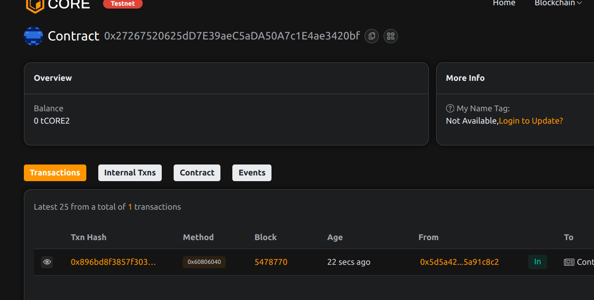

# SocialScoreChain – Decentralized Social Reputation and Influence Index

## 📄 Project Description

SocialScoreChain enables users to maintain and grow decentralized social reputation profiles through community-driven voting. Each account has a public score based on verified actions and peer influence.

## 🎯 Project Vision

To shift social trust and influence metrics from centralized platforms to transparent and immutable ledgers, creating a decentralized social capital system.

## ✨ Key Features

- 🧠 On-chain profiles with initial reputation
- 👍 Upvote/downvote mechanics with safeguards
- ✅ One vote per voter per user
- 📈 Real-time score adjustments based on activity

## 🔮 Future Scope

- DAO-based moderation and score validation
- NFT badges for reaching influence milestones
- Cross-platform integrations via oracles
- Social graph analytics and visualization

## 📜 Contract Details
0x27267520625dD7E39aeC5aDA50A7c1E4ae3420bf
